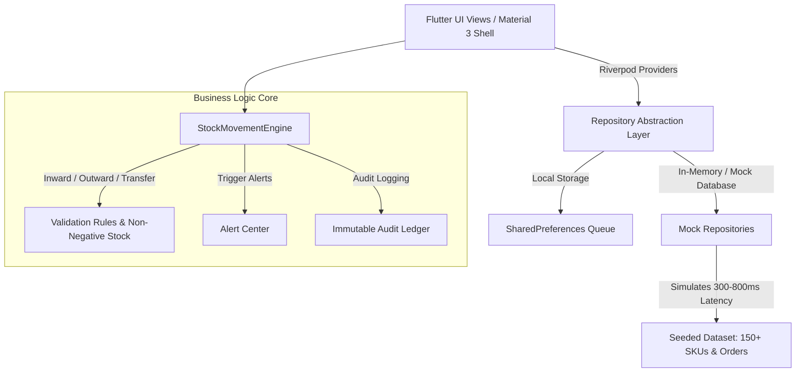

# StockSense: Smart Warehouse Management System (WMS) 📦⚡
> **Industry:** Supply Chain, Logistics & Inventory Optimization  
> **Course:** B.Tech CSE Cross-Platform Application Development Capstone Project  
> **Stack:** Flutter 3.x (Material 3), Dart Null-Safety, Riverpod, GoRouter, Firebase Auth, Local Repository Pattern.

---

## 🌟 Executive Summary
**StockSense** is an enterprise-grade, real-time Warehouse Management System designed to bring control-room visibility, automated stock movement validation, optimal picking routing, and AI-assisted stock insights to warehouse managers, pickers, and dispatch teams. Built with a modern glassmorphic "logistics control room" aesthetic, it supports cross-platform execution (Web, Android, iOS) with responsive navigation and simulated offline sync.

---

## 📐 Architecture & System Flow



---

## 📋 Feature-to-Requirement Mapping

| Requirement / Module | Implementation in StockSense | Status |
| :--- | :--- | :---: |
| **Material 3 Control Room Aesthetic** | Custom Light/Dark glassmorphic theme with Electric Indigo & Teal accents | ✅ Pass |
| **Firebase Auth & Role Access** | Integrated Google & Email Auth with 5-Tier Permissions Matrix | ✅ Pass |
| **Live Telemetry Stream** | Animated activity ticker streaming simulated AGV & stock movements | ✅ Pass |
| **Barcode & QR Scanner** | `mobile_scanner` with scanning overlay + 1-Tap "Simulate Scan" button | ✅ Pass |
| **Zebra Label Generator** | Generates Code128 & QR labels with printable dialog preview | ✅ Pass |
| **Interactive 2D Floor Map** | Heatmap occupancy view across Zones A-D with pinch-to-zoom | ✅ Pass |
| **Stock Movement Engine** | Validation against capacity limits, negative stock prevention, audit writing | ✅ Pass |
| **Guided Order Picking** | Sorting pick routes by optimal warehouse path & scan confirmation | ✅ Pass |
| **Packing & Dispatch Kanban** | Drag & drop columns, courier assignment, and PDF Manifest export | ✅ Pass |
| **Offline Sync Queue** | Local queue replay with sync animation when connectivity restores | ✅ Pass |
| **Executive Analytics** | `fl_chart` valuation trends, category donut, velocity reports & PDF export | ✅ Pass |
| **Enterprise Cost Estimator** | SaaS pricing plans + live interactive slider cost calculator | ✅ Pass |

---

## 🚀 Setup & Execution

### Prerequisites
- Flutter SDK `>=3.16.0`
- Dart SDK `>=3.2.0`

### Step 1: Clone & Install Dependencies
```bash
cd stocksense
flutter pub get
```

### Step 2: Run Application
```bash
# Web
flutter run -d chrome

# Android / iOS Simulator
flutter run
```

### Step 3: Run Automated Verification Tests
```bash
flutter test
flutter analyze
```

---

## 🔐 Demo Credentials & Demo Role Switcher

For quick panel evaluation, use any of the credentials or use the built-in **"Demo Role Switcher"** under Settings:

| Role | Email | Capabilities |
| :--- | :--- | :--- |
| **Admin** | `admin@stocksense.io` | Full access: User management, Analytics, Stock adjustment |
| **Warehouse Manager** | `manager@stocksense.io` | Stock inward/outward, Analytics, Map management |
| **Picker** | `picker@stocksense.io` | Guided order pick lists, scanning, bin navigation |
| **Dispatcher** | `dispatch@stocksense.io` | Packing board, courier assignment, PDF manifests |
| **Viewer** | `viewer@stocksense.io` | Read-only inventory catalog & dashboard |

---

## 🎤 5-Minute Presentation Script for Project Panel

### 1. Introduction (0:00 - 0:45)
> *"Good morning respected panel members. We present **StockSense**, a smart Warehouse Management System built for high-velocity supply chains. It features a modern logistics control room design, simulated live telemetry, offline resilience, and strict role-based access control."*

### 2. Dashboard & Live Telemetry (0:45 - 1:30)
> *"Starting at the **Control Room Dashboard**, you can see real-time animated KPI counters, a circular warehouse capacity gauge, and live telemetry tickers simulating stock movements from automated AGV robots. Notice our **AI Smart Insights** highlighting stockout warnings and zone rebalance recommendations."*

### 3. Barcode Scanning & Label Printing (1:30 - 2:30)
> *"Moving to the **Barcode Scanner**, we demonstrate camera integration with an animated laser overlay. For emulator evaluation, clicking **'Simulate Scan'** instantly fetches an SKU like the Samsung S24, showing a bottom-sheet action menu. We can also launch the **Zebra Thermal Label Generator** to print Code128 and QR barcodes."*

### 4. Interactive 2D Warehouse Map & Movement Engine (2:30 - 3:30)
> *"Our **2D Floor Map** visualizes occupancy heatmaps across Zones A through D. Clicking a zone lets us inspect racks and bins. When executing a **Goods Inward (GRN)** or **Outward Dispatch**, our pure Dart **StockMovementEngine** prevents negative stock, checks capacity boundaries, and writes an entry to our immutable **Audit Ledger**."*

### 5. Order Picking, Dispatch PDF & Analytics (3:30 - 4:30)
> *"In the **Picking Workflow**, pickers follow an algorithmically optimized route through bin locations. Once picked, orders move to the **Packing Kanban Board** where dispatch operators assign couriers like BlueDart and generate official **PDF Shipping Manifests** using our built-in PDF engine."*

### 6. Pricing Calculator & Role Permissions (4:30 - 5:00)
> *"Finally, under **Settings**, our built-in **Role Switcher** lets the panel toggle between Admin, Picker, and Viewer modes to observe adaptive UI permissions in real-time. We also include an **Enterprise SaaS Pricing Calculator** with interactive cost estimation."*
