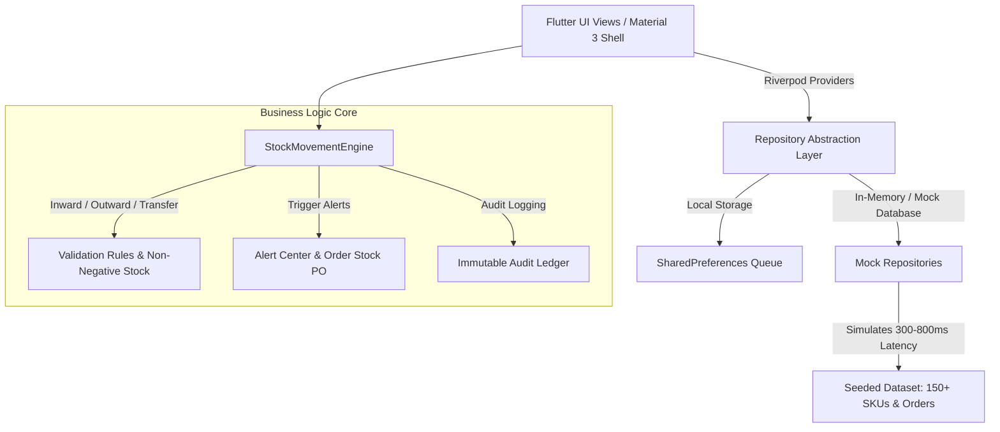

# StockSense: Smart Warehouse Management System (WMS) 📦⚡

[](https://flutter.dev)
[](https://vercel.com)
[](LICENSE)
[](test/)

> **Industry:** Supply Chain, Logistics & Inventory Optimization  
> **Course:** Capstone Project  
> **Stack:** Flutter 3.x (Material 3), Dart Null-Safety, Riverpod, GoRouter, Firebase Auth, Local Repository Pattern.  
> **GitHub Repo:** [https://github.com/AtharvaKalekar/StockSense.git](https://github.com/AtharvaKalekar/StockSense.git)

---

## 🌟 Executive Summary

**StockSense** is an enterprise-grade, real-time Warehouse Management System designed to bring control-room visibility, automated stock movement validation, optimal picking routing, low-stock reordering, executive analytics, and audit history to warehouse managers, pickers, and dispatch teams. Built with a modern glassmorphic "logistics control room" aesthetic, it supports cross-platform execution (Web, Android, iOS) with responsive navigation and simulated offline sync.

---

## 🚀 Key Modules & Highlights

### ⚡ 1. Low Stock & Exception Alerts (`/alerts`)
- **Severity Classification**: Categorized stock alerts into **Critical**, **Warning**, and **Info** levels with glowing status indicators.
- **Order Stock PO Generator**: 1-tap **"Order Stock"** Purchase Order replenishment workflow with pre-filled SKU codes, quantity required, preferred supplier selection, and confirmation toasts.
- **Batch Reorder**: **"Order All Low Stock"** header button for automated batch PO generation.
- **RBAC Enforcement**: Reordering restricted to Admin and Warehouse Manager roles.

### 📊 2. Executive Inventory Analytics (`/analytics`)
- **Valuation Telemetry Cards**: Real-time metrics for **Total Inventory Valuation ($)**, **Active SKUs Count**, **Turnover Rate (x/yr)**, and **Dead Stock Percentage**.
- **Interactive Charts (`fl_chart`)**:
  - Smooth line chart illustrating **Inbound vs Outbound Monthly Volume**.
  - Bar chart breakdown of **Inventory Category Valuation**.
- **Fast-Moving SKU Ranking**: Top-performing items sorted by turnover velocity.
- **PDF Report Export**: 1-click export of executive inventory reports via [`PdfGenerator`](lib/core/utils/pdf_generator.dart).

### 📜 3. Transaction Audit Ledger (`/audit-history`)
- **Complete Movement History**: Tracks all **Inward (GRN)**, **Outward**, **Transfer**, **Adjustment**, and **Pick** operations.
- **Quantity Delta Pills**: Color-coded stock change indicators (`+150 Units` emerald vs `-50 Units` crimson).
- **Search & Filter Tabs**: Filter audit logs by operator ID, SKU code, location tag (Zone/Aisle/Bay), or transaction type.

### 🛠️ 4. WMS Core Features
- **Barcode & QR Scanner**: `mobile_scanner` with scanning overlay + 1-Tap "Simulate Scan" menu.
- **Zebra Thermal Label Generator**: Generates printable Code128 & QR labels.
- **Interactive 2D Warehouse Floor Map**: Occupancy heatmaps across Zones A-D with bin inspection.
- **Stock Movement Engine**: Pure Dart validation engine preventing negative stock & enforcing location bin limits.
- **Picking & Dispatch Kanban Board**: Pick routes optimized by warehouse path + courier shipping manifest PDF generation.

---

## 📐 Architecture & System Flow



---

## ⚡ Deploy Ready on Vercel

The project includes a pre-configured [`vercel.json`](vercel.json) file setup for single-page application (SPA) routing, asset caching, and security headers.

### Deploying via Vercel CLI:
```bash
# Build production web bundle
flutter build web --release

# Deploy to Vercel
npx vercel --prod
```

### Deploying via GitHub & Vercel Dashboard:
1. Import repository `AtharvaKalekar/StockSense` on **[vercel.com/new](https://vercel.com/new)**.
2. Select **Framework Preset**: `Other`.
3. Set **Output Directory**: `build/web`.
4. Click **Deploy**.

---

## 🚀 Local Setup & Execution

### Prerequisites
- Flutter SDK `>=3.16.0`
- Dart SDK `>=3.2.0`

### Step 1: Clone & Install Dependencies
```bash
git clone https://github.com/AtharvaKalekar/StockSense.git
cd StockSense
flutter pub get
```

### Step 2: Run Application Locally
```bash
# Run Web Server
flutter run -d chrome

# Run Android / iOS / Desktop
flutter run
```

### Step 3: Automated Verification Tests
```bash
flutter analyze
flutter test
```

---

## 🔐 Demo Credentials & Demo Role Switcher

Use any of the demo credentials below or switch roles on-the-fly using the **Demo Role Switcher** in **Settings**:

| Role | Email | Capabilities |
| :--- | :--- | :--- |
| **Admin** | `admin@stocksense.io` | Full access: User management, Analytics, Stock adjustment, Reorder PO |
| **Warehouse Manager** | `manager@stocksense.io` | Stock inward/outward, Analytics, Low stock reorder, Map management |
| **Picker** | `picker@stocksense.io` | Guided order pick lists, barcode scanning, bin navigation |
| **Dispatcher** | `dispatch@stocksense.io` | Packing board, courier assignment, PDF manifests |
| **Viewer** | `viewer@stocksense.io` | Read-only inventory catalog & telemetry dashboard |

---

## 📄 License
This project is licensed under the MIT License.
